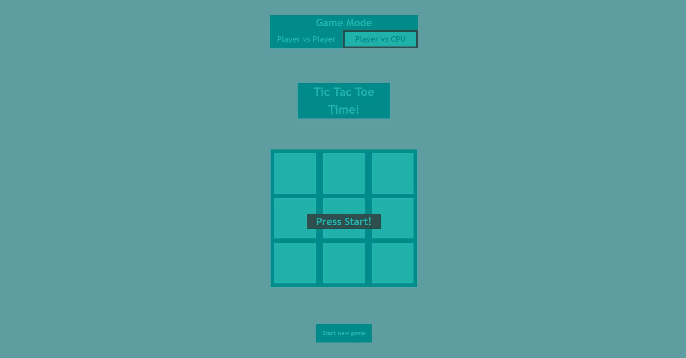
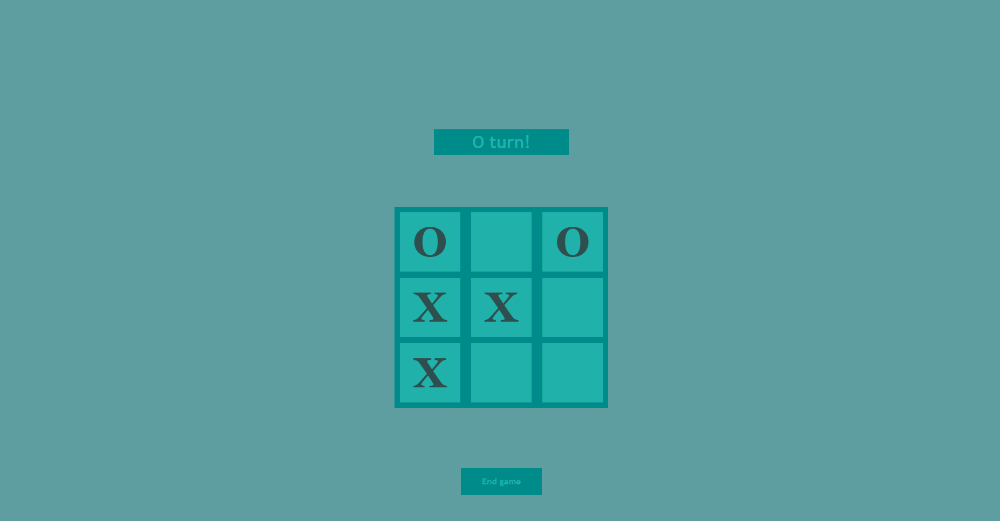
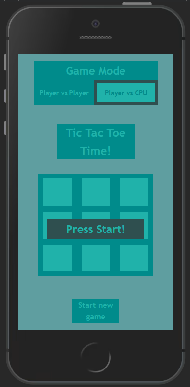
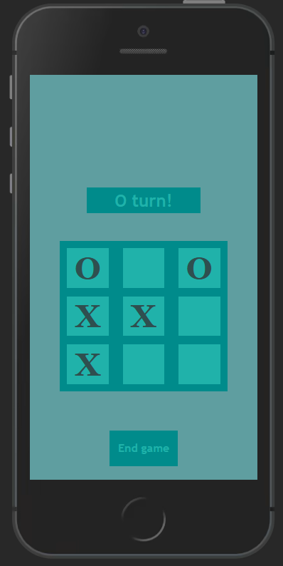

# Tic Tac Toe Game

A tic tac toe game fully made with HTML, CSS and JavaScript. It's possible to play as both Player vs CPU and Player vs Player between each round. The CPU is smart enough to perceive a win opportunity and catch it.

#### Examples

-   PC-like screen:

    
    

-   Mobile-like screen:

    
    

## Contributing

Issues and pull requests are accepted.

## Usage

The program can be accessed by downloading all the files and opening index.html in a browser.

## Author

#### João Vitor Sobral

Github: sobraljvss  
Contact: sobraljvss@gmail.com
